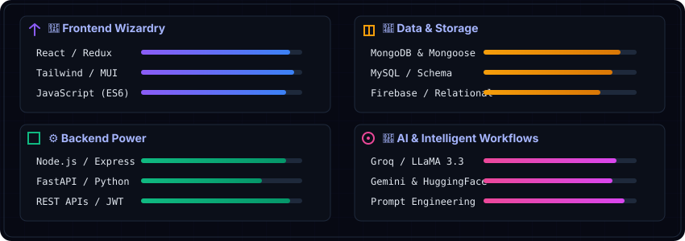

  <!-- Interactive Glowing Cyber Dashboard Header -->
  

 

  

 

---

## 👤 About The Developer

I am a **Software Engineer** specializing in the MERN Stack and LLM Integrations. Currently completing my **Bachelor's in Information Technology** at the **University of the Punjab** (2022 - 2026), my primary expertise lies in bridging the gap between robust API architectures and highly interactive, responsive user interfaces.

During my tenure as a **Web Development Intern** at **ITSOLERA Pvt Ltd**, I gained extensive experience building scalable database schemas, designing granular role-based access controllers (RBAC), and implementing state-driven applications. I love implementing modern intelligence layers (such as Groq, Gemini, and Hugging Face pipelines) into everyday software products to drive real-world value.

---

## 🛠️ Cybernetic Tech System
> The tech stack below is represented via a custom-designed HUD interface. No boring standard badges here.

  

---

## 🗂️ Production-Grade Systems

<table border="0">
<tr>
<td width="50%" valign="top">

### 🛒 Lookify (AI E-Commerce)
> Full-stack shop platform powered by generative wardrobe styling pipelines.

*   **⚡ AI Virtual Try-On**: Connects to Hugging Face models to offer real-time customer photo clothing trials.
*   **🤖 LLaMA 3.3 Assistant**: Integrates Groq LLaMA models queryable on MongoDB item inventory for customer service.
*   **🛡️ Custom Commerce Logic**: Multi-step transactional flow, dynamic routing, and context state synchronization.
*   **Tech**: `React` · `Node.js` · `Express` · `MongoDB` · `Groq API` · `Hugging Face API`

  <a href="https://github.com/abbasubsit/lookify"><b>⚡ Source Repository</b></a>

</td>
<td width="50%" valign="top">

### 🏥 Pharmacy MSMS (Enterprise POS)
> Comprehensive inventory, POS, and batch tracking medical management panel.

*   **📦 FIFO Batch Stock**: Automatic batch consumption logic (First-In, First-Out) safeguarding inventory counts.
*   **🧾 POS Receipt Engine**: Rapid POS search indexing with 80mm ticket printing pipelines.
*   **📊 Analytics Suite**: Visual interactive sales analytics dashboards using Recharts with instant CSV reports.
*   **Tech**: `Vite` · `React` · `Node.js` · `Express` · `MongoDB` · `TailwindCSS` · `Recharts`

  <a href="https://github.com/abbasubsit/msms-project"><b>⚡ Source Repository</b></a>

</td>
</tr>
</table>

---

## 📊 Analytics Dashboard

  <table border="0">
    <tr>
      <td width="50%" align="center">
        
      </td>
      <td width="50%" align="center">
        
      </td>
    </tr>
  </table>

  

   
  

---

## 🤝 Connect & Network

 

 

  

